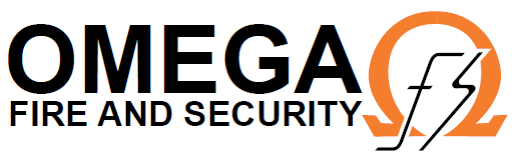

<p align="center">
  
</p>

<h2>
  Omega BMS
  <a href="https://github.com/Omega/bms/releases">
    
  </a>
</h2>

A desktop application for handling ERP (Enterprise Resource Planning) to manage various aspects of a business such as operations, human resources, project management, quoting, invoicing, task management, attendance, compliance and accounting.
Project originally forked off https://github.com/hql287/Manta

<a href="#screenshots">Screenshots</a> •
<a href="#features">Features</a> •
<a href="#downloads">Downloads</a> •
<a href="#technologies">Technologies</a> •
<a href="#why">Why?</a> •
<a href="#goals">Goals</a> •
<a href="#development">Development</a> •
<a href="#faq">FAQ</a> •
<a href="#acknowledgement">Acknowledgement</a>

### Screenshots

### Features
* 🏗  Simple WYSIWUG Easy to use UI
* 📐 Use SVGs for logo for better printing.
* 🎨 Custom designed & highly customizable templates.
* 🏷 Custom statuses for invoices.
* 📊 Export PDF for print or email.
* 🔒 Complete Privacy & Security of your data.
* 💯 Built using the latest web technologies from Google.

### Downloads

macOS | Windows | Linux
-----------------| ---| ---|

[More Download Options](https://github.com/omega-fire-and-security/bms-client/releases)

#### Supported Platforms
Following platforms are supported by Electron:

**macOS**
The minimum version supported is macOS 10.9.

**Windows**
Windows 7 and later are supported

**Linux:**

- Ubuntu 12.04 and later
- Fedora 21
- Debian 8

[More information](https://github.com/electron/electron/blob/master/docs/tutorial/supported-platforms.md).

Note that on Linux, some users might experience a GPU bug where the select options rendered as a black box, see [issue #128 of Manta](https://github.com/hql287/Manta/pull/128) and [issue #4322 of Electron](https://github.com/electron/electron/issues/4322). This can be fixed by disabling hardware acceleration like so:

# ```sh
# manta --disable-hardware-acceleration
# ```

> Remember that doing this might lead to some degradation of the app's performance. This is why "the fix" is not included by default.

### Technologies
* [Electron](https://github.com/electron/electron)
* [React](https://github.com/facebook/react)
* [Redux](https://github.com/reactjs/redux)
* [React-DnD](https://github.com/react-dnd/react-dnd)
* [React-Beautiful-DnD](https://github.com/atlassian/react-beautiful-dnd)
* [React-Motion](https://github.com/chenglou/react-motion)
* [Webpack](https://github.com/webpack/webpack)

### Goals
With that in mind, I know that Manta would need to satisfy these criteria:

* 🚀 Fast!!!
* 👍 Friendly UI & UX
* 🎉 Has nice looking templates
* 🔒 Does not touch user’s data
* 💰 Affordable

### FAQ

* **Is this app built with Electron?**

Yes, it's built on top of [Electron](#). Please see the [Technologies](#technologies) section for more info.

* **What boilerplate did you use**

https://github.com/hql287/Manta

* **What CSS/UI Framework did you use?**

I wrote all the CSS myself. I only use Bootstrap for prototyping at first. But I gradually encapsulate most of the style to the component with the help of [`styled-components`](https://www.styled-components.com/). There is some places still use Bootstrap mostly for layout purpose but I'll get rid of it eventually.

* **Where did you get the icons?**

[ionicons](http://ionicons.com/). They're great!